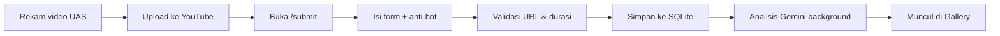

# UAS IoT — Pengumpulan Video Refleksi & Inovasi

Aplikasi web pengumpulan UAS mata kuliah **Internet of Things** untuk **Digitech University**. Mahasiswa mengunggah video refleksi ke YouTube, lalu mengumpulkan link-nya melalui form. Video ditampilkan di gallery publik, dan dosen dapat meninjau hasil analisis AI (Google Gemini) melalui dashboard admin.

**Production:** [https://uas-digitech.mitradigitalservice.id](https://uas-digitech.mitradigitalservice.id)

---

## Daftar Isi

- [Fitur](#fitur)
- [Struktur UAS Video (4 Bagian)](#struktur-uas-video-4-bagian)
- [Tech Stack](#tech-stack)
- [Struktur Project](#struktur-project)
- [Persyaratan](#persyaratan)
- [Instalasi Lokal](#instalasi-lokal)
- [Environment Variables](#environment-variables)
- [Scripts NPM](#scripts-npm)
- [Alur Aplikasi](#alur-aplikasi)
- [Analisis AI (Gemini)](#analisis-ai-gemini)
- [Anti-Bot Form Submit](#anti-bot-form-submit)
- [API Endpoints](#api-endpoints)
- [Dashboard Admin](#dashboard-admin)
- [Deploy di aaPanel (VPS)](#deploy-di-aapanel-vps)
- [Troubleshooting](#troubleshooting)
- [Catatan Penting](#catatan-penting)

---

## Fitur

### Mahasiswa (publik)

| Fitur | Keterangan |
|-------|------------|
| Halaman ketentuan | Rubrik lengkap UAS di `/ketentuan` |
| Form pengumpulan | Kelas, nama, NPM, URL YouTube di `/submit` |
| Validasi video | URL YouTube valid, durasi **2–5 menit** |
| Gallery video | Embed YouTube + filter kelas & pencarian nama/NPM |
| Hasil analisis AI | Ditampilkan via modal (jika analisis sudah selesai) |
| Anti-bot | Honeypot, token bertanda tangan, delay 3 detik, rate limit |

### Dosen (admin — `/admin`, tidak ditampilkan di menu)

| Fitur | Keterangan |
|-------|------------|
| Login password | Akses terproteksi via `ADMIN_PASSWORD` |
| Tabel submission | Nomor urut, filter kelas, pencarian, skor AI |
| Detail analisis | Checklist rubrik lengkap + catatan per bagian |
| Analisis ulang | Trigger ulang pipeline Gemini per mahasiswa |
| Hapus data | Hapus submission (NPM bisa submit ulang) |
| Export Excel | Kelas, nama, NPM, ceklis rubrik, skor |
| Penggunaan API | Log pemakaian Gemini & YouTube (lokal) |

---

## Struktur UAS Video (4 Bagian)

Durasi video: **minimal 2 menit**, **maksimal 5 menit**.

| Bagian | Isi |
|--------|-----|
| 1. Perkenalan Diri | Nama lengkap, NPM, kelas |
| 2. Refleksi & Feedback Dosen | Refleksi perkuliahan + praktikum + feedback dosen |
| 3. Gagasan Inovasi IoT | Ide inovasi orisinal (bukan project tugas besar saat ini), permasalahan, cara kerja, sensor, manfaat |
| 4. Penutup | Kesimpulan dan harapan IoT |

Ketentuan umum:
- Dikerjakan **individu**
- Wajah mahasiswa **terlihat jelas**
- Rekaman **sendiri** (bukan AI avatar / text-to-speech)
- Video YouTube **public** atau **unlisted**

Kelas yang tersedia: **C123**, **C223**, **A23**

---

## Tech Stack

| Layer | Teknologi |
|-------|-----------|
| Frontend | Next.js 16 (App Router), React 19, Tailwind CSS 4 |
| Backend | Next.js API Routes |
| Database | SQLite + Prisma 7 (`@prisma/adapter-better-sqlite3`) |
| AI | Google Gemini API (multimodal video) |
| Video download | yt-dlp (server-side, untuk analisis AI) |
| Export | SheetJS (`xlsx`) |
| Deploy | Node.js + PM2 + Nginx (aaPanel) |

---

## Struktur Project

```
uas-iot/
├── app/
│   ├── page.tsx                 # Gallery video (home)
│   ├── submit/page.tsx          # Form pengumpulan
│   ├── ketentuan/page.tsx       # Ketentuan UAS
│   ├── admin/
│   │   ├── page.tsx             # Dashboard admin
│   │   └── [id]/page.tsx        # Detail analisis AI
│   └── api/
│       ├── submit/              # POST submit + GET challenge
│       ├── submissions/         # GET list & detail, DELETE, analyze
│       └── admin/               # login, usage
├── components/                  # UI components
├── lib/
│   ├── db.ts                    # Prisma client
│   ├── gemini.ts                # Analisis video AI
│   ├── youtube.ts               # Validasi URL & durasi
│   ├── antibot.ts               # Proteksi form
│   ├── usage.ts                 # Log pemakaian API
│   └── export-submissions.ts    # Export Excel
├── prisma/
│   ├── schema.prisma
│   └── migrations/
├── public/
│   └── logo_digitech.png
└── .env                         # Konfigurasi (jangan di-commit)
```

---

## Persyaratan

- **Node.js** 20 atau lebih baru
- **npm** 9+
- **yt-dlp** — wajib di server untuk analisis AI
- **GEMINI_API_KEY** — opsional (tanpa ini, submit tetap jalan; AI di-skip)
- **YOUTUBE_API_KEY** — opsional (validasi durasi lebih akurat)

---

## Instalasi Lokal

### 1. Clone & install dependency

```bash
git clone <url-repo> uas-iot
cd uas-iot
npm install
```

### 2. Konfigurasi environment

```bash
cp .env.example .env
```

Edit `.env` — minimal isi `ADMIN_PASSWORD`. Lihat [Environment Variables](#environment-variables).

### 3. Migrasi database

```bash
npm run db:migrate
```

Database SQLite dibuat di `prisma/dev.db`.

### 4. Install yt-dlp (untuk analisis AI)

```bash
# macOS
brew install yt-dlp

# Linux
sudo curl -L https://github.com/yt-dlp/yt-dlp/releases/latest/download/yt-dlp \
  -o /usr/local/bin/yt-dlp
sudo chmod a+rx /usr/local/bin/yt-dlp
```

### 5. Jalankan development server

```bash
npm run dev
```

Buka [http://localhost:3000](http://localhost:3000)

Admin: [http://localhost:3000/admin](http://localhost:3000/admin)

---

## Environment Variables

| Variable | Wajib | Default | Keterangan |
|----------|-------|---------|------------|
| `DATABASE_URL` | Ya | `file:./prisma/dev.db` | Connection string SQLite |
| `ADMIN_PASSWORD` | Ya | — | Password login dashboard admin |
| `GEMINI_API_KEY` | Opsional* | — | API key dari [Google AI Studio](https://aistudio.google.com/apikey) |
| `GEMINI_MODEL` | Tidak | `gemini-2.5-flash` | Model utama analisis video |
| `GEMINI_MODEL_FALLBACKS` | Tidak | `gemini-2.0-flash-lite,gemini-1.5-flash` | Fallback jika model utama kena quota (pisahkan koma) |
| `YOUTUBE_API_KEY` | Tidak | — | YouTube Data API v3 — [Google Cloud Console](https://console.cloud.google.com/) |
| `ANTIBOT_SECRET` | Tidak | `ADMIN_PASSWORD` | Secret HMAC token form submit |
| `NEXT_PUBLIC_APP_URL` | Tidak | — | URL publik aplikasi (production) |

\* Tanpa `GEMINI_API_KEY`, mahasiswa tetap bisa submit; status AI = `skipped`.

### Contoh `.env`

```env
DATABASE_URL="file:./prisma/dev.db"

GEMINI_API_KEY="AIza..."
GEMINI_MODEL="gemini-2.5-flash"

YOUTUBE_API_KEY="AIza..."

ADMIN_PASSWORD="password-kuat-anda"
ANTIBOT_SECRET="random-secret-panjang"

NEXT_PUBLIC_APP_URL="https://uas-digitech.mitradigitalservice.id"
```

---

## Scripts NPM

| Command | Fungsi |
|---------|--------|
| `npm run dev` | Development server (port 3000) |
| `npm run build` | Generate Prisma client + production build |
| `npm start` | Jalankan production server |
| `npm run lint` | ESLint |
| `npm run db:migrate` | Buat/apply migrasi database |
| `npm run db:push` | Push schema ke DB tanpa migrasi |

---

## Alur Aplikasi

### Mahasiswa



1. Rekam video sesuai ketentuan (2–5 menit)
2. Upload ke YouTube (public/unlisted)
3. Buka `/submit`, isi kelas, nama, NPM, URL
4. Sistem validasi & simpan
5. Analisis AI berjalan di background
6. Video tampil di gallery; hasil analisis bisa dilihat via modal

### Dosen

1. Buka `/admin` → login
2. Lihat daftar submission (filter & cari)
3. Klik **Detail** untuk analisis lengkap
4. **Export Excel** untuk rekap nilai/checklist
5. **Hapus** jika mahasiswa perlu submit ulang

---

## Analisis AI (Gemini)

Pipeline analisis (background, non-blocking):

1. Unduh video via **yt-dlp** (resolusi rendah, max 360p)
2. Upload ke **Gemini Files API**
3. Prompt rubrik 4 bagian UAS + deteksi wajah
4. Simpan JSON hasil + skor ke database

Output per submission:

- Skor kepatuhan (0–100) — hanya di admin
- Checklist per bagian (Ya/Tidak + catatan)
- Deteksi wajah, durasi, indikasi TTS/avatar (flag)

**Retry & fallback:** otomatis retry saat error 429; coba model fallback jika quota habis.

**Penting:** Analisis AI adalah **asisten penilaian**, bukan penentu nilai otomatis. Dosen tetap meninjau manual.

### Kuota Gemini

- Pantau di [Google AI Studio](https://aistudio.google.com/) atau [ai.dev/rate-limit](https://ai.dev/rate-limit)
- Admin dashboard menampilkan **log pemakaian lokal** (request & token)
- Aktifkan billing di Google AI Studio untuk production skala banyak mahasiswa

---

## Anti-Bot Form Submit

Lapisan proteksi di `/submit`:

| Lapisan | Keterangan |
|---------|------------|
| Honeypot | Field tersembunyi; bot yang mengisi ditolak |
| Token HMAC | Diterbitkan via `GET /api/submit/challenge` |
| Delay 3 detik | Submit terlalu cepat ditolak |
| Rate limit | Max 10 percobaan per IP per jam |

---

## API Endpoints

| Method | Endpoint | Auth | Fungsi |
|--------|----------|------|--------|
| `GET` | `/api/submissions` | Publik | List submission (`?kelas=C123`) |
| `GET` | `/api/submissions/[id]` | Publik | Detail satu submission |
| `GET` | `/api/submit/challenge` | Publik | Token anti-bot |
| `POST` | `/api/submit` | Publik + anti-bot | Submit UAS baru |
| `POST` | `/api/submissions/[id]/analyze` | Admin Bearer | Analisis ulang |
| `DELETE` | `/api/submissions/[id]` | Admin Bearer | Hapus submission |
| `POST` | `/api/admin/login` | — | Verifikasi password admin |
| `GET` | `/api/admin/usage` | Admin Bearer | Statistik pemakaian API |

Header auth admin: `Authorization: Bearer <ADMIN_PASSWORD>`

---

## Dashboard Admin

| URL | Fungsi |
|-----|--------|
| `/admin` | Login, tabel submission, export, usage API |
| `/admin/[id]` | Detail analisis AI per mahasiswa |

### Export Excel

Kolom: **Kelas**, **Nama Mahasiswa**, **NPM**, checklist 5 rubrik (Ya/Tidak), **Skor**.

Export mengikuti **filter aktif** di tabel admin.

---

## Deploy di aaPanel (VPS)

### 1. Siapkan server

- VPS dengan aaPanel terinstall
- Node.js **20+** (via aaPanel App Store)
- Domain: `uas-digitech.mitradigitalservice.id` → A record ke IP VPS

### 2. Upload project

```bash
cd /www/wwwroot/uas-digitech.mitradigitalservice.id
git clone <url-repo> .
# atau upload via SFTP
```

### 3. Install yt-dlp

```bash
sudo curl -L https://github.com/yt-dlp/yt-dlp/releases/latest/download/yt-dlp \
  -o /usr/local/bin/yt-dlp
sudo chmod a+rx /usr/local/bin/yt-dlp
yt-dlp --version
```

### 4. Konfigurasi & build

```bash
cp .env.example .env
nano .env   # isi production values

npm install
npm run db:migrate
npm run build
```

### 5. Jalankan dengan PM2

```bash
pm2 start npm --name uas-iot -- start
pm2 save
pm2 startup
```

### 6. Nginx reverse proxy

Di aaPanel → Website → domain → Reverse Proxy:

- Target: `http://127.0.0.1:3000`
- Aktifkan **SSL** (Let's Encrypt)

Contoh config Nginx (referensi):

```nginx
location / {
    proxy_pass http://127.0.0.1:3000;
    proxy_http_version 1.1;
    proxy_set_header Upgrade $http_upgrade;
    proxy_set_header Connection 'upgrade';
    proxy_set_header Host $host;
    proxy_set_header X-Real-IP $remote_addr;
    proxy_set_header X-Forwarded-For $proxy_add_x_forwarded_for;
    proxy_set_header X-Forwarded-Proto $scheme;
}
```

### 7. Permission database

Pastikan folder `prisma/` **writable** oleh user Node:

```bash
chmod 755 prisma
chmod 664 prisma/dev.db   # setelah DB dibuat
```

### 8. Update aplikasi

```bash
git pull
npm install
npm run db:migrate
npm run build
pm2 restart uas-iot
```

---

## Troubleshooting

### Analisis AI gagal — "Gagal mengunduh video"

- Pastikan **yt-dlp** terinstall dan ada di PATH
- Cek video YouTube bisa diakses (public/unlisted)
- Jalankan manual: `yt-dlp -f worst "URL_YOUTUBE"`

### Error 429 Gemini (quota exceeded)

- Tunggu reset kuota atau ganti `GEMINI_MODEL`
- Set `GEMINI_MODEL_FALLBACKS` di `.env`
- Aktifkan billing di Google AI Studio
- Pantau di admin → **Penggunaan API**

### Durasi video tidak terdeteksi

- Tambahkan `YOUTUBE_API_KEY` di `.env`
- Tanpa API key, sistem fallback scrape halaman YouTube (kurang stabil)

### NPM sudah terdaftar

- Admin hapus submission di `/admin` → mahasiswa bisa submit ulang

### Port 3000 sudah dipakai (development)

```bash
lsof -i:3000
kill <PID>
npm run dev
```

### Build gagal Prisma

```bash
npx prisma generate
npm run db:migrate
npm run build
```

---

## Catatan Penting

- **NPM unik** — satu NPM hanya satu submission (kecuali dihapus admin)
- **Skor AI** hanya tampil di admin, tidak di gallery publik
- **Link admin** disembunyikan dari navbar; akses langsung via `/admin`
- **Database SQLite** cocok untuk skala kecil–menengah; backup rutin file `prisma/dev.db`
- Jangan commit file `.env` ke repository

---

